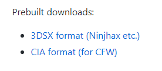
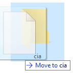
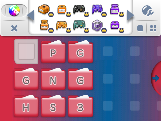

## How to install badges
---
This is a tutorial on how to install custom badges for your homescreen. Make sure you can access [homebrew](http://smealum.github.io/3ds/) and make sure that you have installed and have opened the Nintendo Badge Arcade at least once before attempting.

### Step 1

Go and download [GYTB](https://github.com/MrCheeze/GYTB) in either .3dsx or .cia format ([CFW](https://3ds.hacks.guide) required for .cia installation).

### Step 2

Install it by dragging the .3dsx file into the `3ds` folder on your 3DS's SD card. If you have the .cia file, put the file in your `cia` folder and install it using FBI.

### Step 3

Make a new folder on your SD card called `badges` and put your unzipped badges in here, you can have up to 1000 badges in this folder*.

### Step 4

Now open up GYTB and once it is done installing, you should have some new badges when you open up the badge drawer.

*The sizes of the badges are in intervals of 64, so the minimum size requirement for badges is 64x64 px.