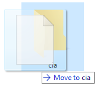
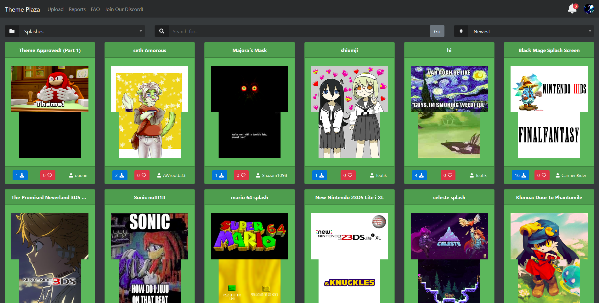

#### How to install custom splashes on Nintendo 3DS

This is a tutorial on installing custom [Luma3DS splashes](https://github.com/AuroraWright/Luma3DS/wiki/Optional-features#config-menu-options). Make sure you have [CFW](https://3ds.hacks.guide/) installed before attempting.

### Step 1

Go to the [Anemone](https://github.com/astronautlevel2/Anemone3DS/releases) GitHub page and download the `Anemone3DS.cia` file. *

### Step 2

Drag the .cia file into the `cia` (or any other folder) on your 3DS's SD card.

### Step 3

Open FBI and go the SD -> `cia` -> Then click on Anemone3DS.cia and click on Install.

### Step 4

Now go to [Theme Plaza](https://themeplaza.eu) and filter items by splashes. You can press the R button on your console to activate the QR scanner and scan a QR code on the site.

