<!-- tabs:start -->

#### **How to make themes**

Here is a tutorial on how to make themes (WIP, I am not a professional at this)

### Step 1

Download the [.zip](https://github.com/wrathsoffire76/tutorials/raw/master/download/Theme%20Templates.zip) file which will have all the resourses available for making themes.

### Step 2

Download the latest version of [Usagi.](https://github.com/usagirei/3DS-Theme-Editor/releases)

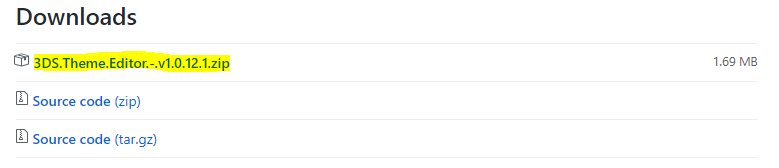

### Step 3

Download a photo-editor like [Gimp](https://www.gimp.org/downloads/), [Paint.net](https://www.getpaint.net/download.html) or [Photoshop](https://www.adobe.com/ie/products/photoshop.html)

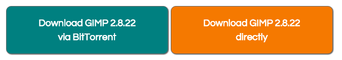

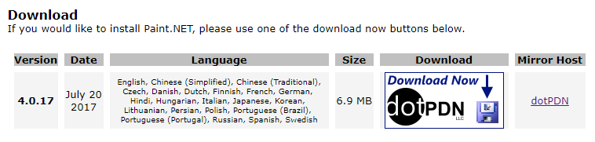

### Step 4

Start to gather your resources for making the theme. (Pictures, SFX, Music, etc.)

### Step 5

Extract the .zip file using a program such as [WinRAR](http://www.win-rar.com/download.html) or [7-Zip.](http://www.7-zip.org/download.html)

### Step 6

Open your photo-editor and copy and edit the template files to your liking. You only need to edit the size to make it compatible with Usagi.

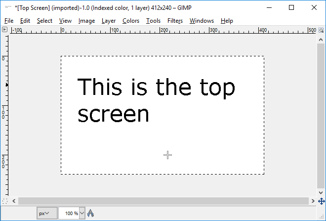

### Step 7

When you are happy with your pictures, save the files and open Usagi.

### Step 8

In Usagi, start your project by filling out the informaton and importing the top and bottom pictures.

### Step 9

Go to the flags category and start enabling the flags for the things you would like to change, then go to the colour tab and edit the UI colours to your liking.

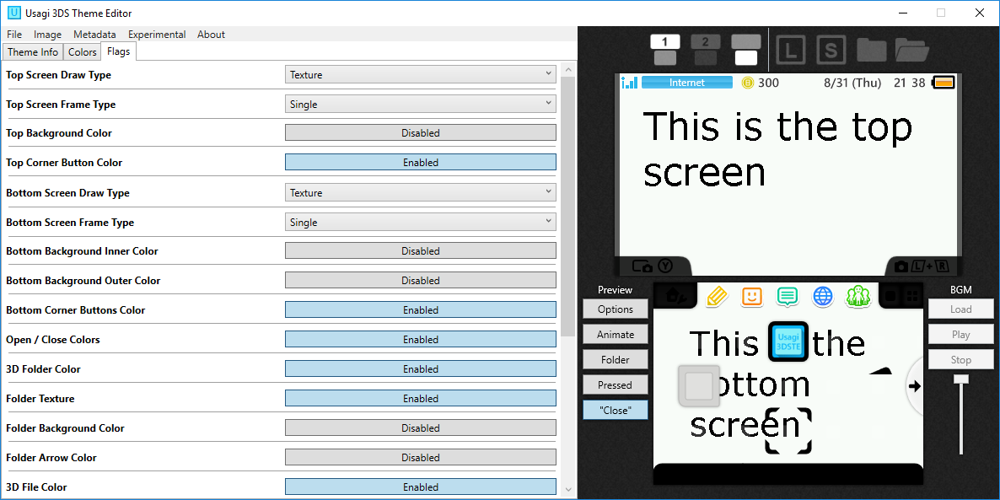

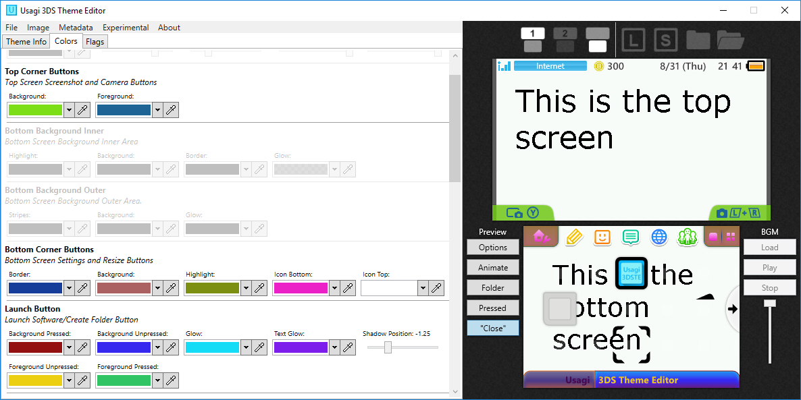

### Step 10

Once you have set up your textures and colours, start importing your sounds through the CWAV manager.

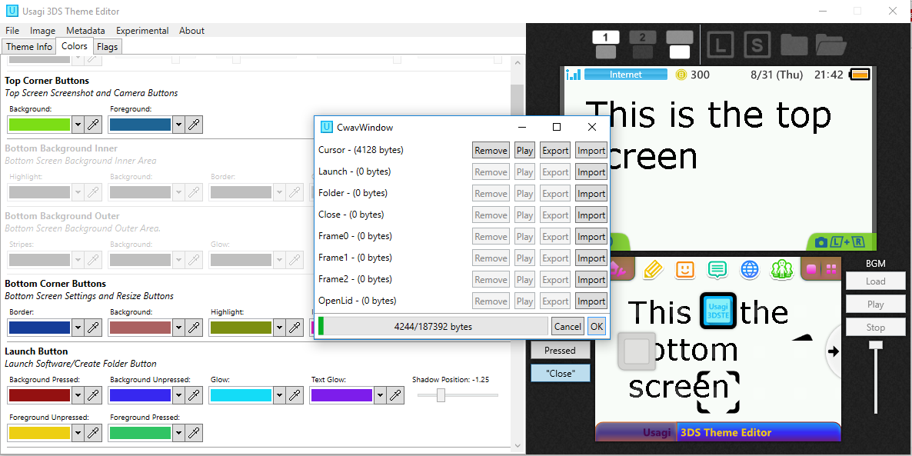

### Step 11

To finalize, look over everything and make sure it's all correct, then generate a preview and either import a file texture or take one from the theme and export it.

#### **How to convert music and SFX**

### Step 1

Download the modifed version of [Audacity](https://github.com/jackoalan/audacity/releases).

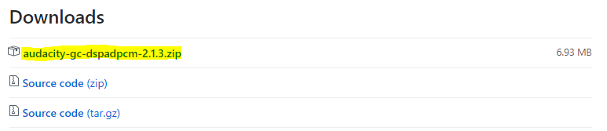

### Step 2

Download the latest version of [Looping Audio Converter](https://github.com/libertyernie/LoopingAudioConverter/releases).

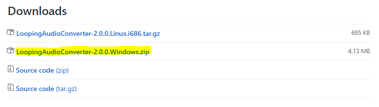

### Step 3

Obtain a source file for your Music/SFX. It helps if the files are in `.wav` format (although not required).

### Step 4

Get the source files and put them into Audacity. If you are making music, set the Hz rate to 32,000\. If you are making SFX, set the Hz rate to 16,000.

### Step 5

If you are making SFX and have the modfied Audacity opened, export the file as `.bcwav` and install the SFX using the CWAV manager in Usagi.

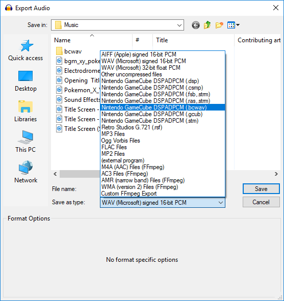

### Step 6

If you are making music, open Looping Audio Converter and drag the file into it and copy the settings from the screenshot below, then just export as `.bcstm` and put the file into your themes folder. Make sure the file size is below 3.4MB

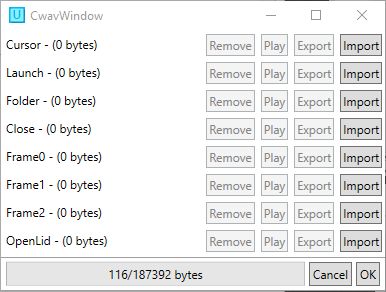

#### **Other resources**

In times of trouble, here are places that might help you.

*   [Ryumaru's texture tutorials for themes.](https://gbatemp.net/blog/ryumaru.360795/) These are really good tutorials, especially if you have Photoshop or GIMP.
*   [The Theme Plaza Discord.](https://discord.gg/2hUQwXz) Really nice community and lots of helpful people for theme making, I'm on there quite a lot too if you want any help from me.
*   [Smash Custom Music.](http://smashcustommusic.com/) This is the best place for all videogame music in bcstms and other formats.

<!-- tabs:end -->