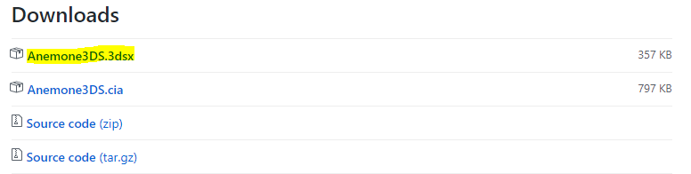

<!-- tabs:start -->

#### **How to install themes (Homebrew)**

This is a tutorial on how to install custom themes. Make sure you can access [homebrew](http://smealum.github.io/3ds/) before attempting.

### Step 1

Go to the [Anemone](https://github.com/astronautlevel2/Anemone3DS/releases) GitHub page and download the `Anemone3DS.3dsx` file.

### Step 2

Install it by dragging the .3dsx file into the `3ds` folder on your 3DS's SD card.

### Step 3

Access the homebrew launcher through your chosen exploit and click on the Anemone app

### Step 4

Now either put your files on the SD cards `themes` folder or scan a QR code on the theme download of [Theme Plaza.](https://themeplaza.eu/)

#### **How to install themes (CFW)**

This is a tutorial on how to install custom themes. Make sure you have [CFW](https://3ds.hacks.guide/) installed before attempting.

### Step 1

Go to the [Anemone](https://github.com/astronautlevel2/Anemone3DS/releases) GitHub page and download the `Anemone3DS.cia` file. *

### Step 2

Drag the .cia file into the `cia` (or any other folder) on your 3DS's SD card.

### Step 3

Open FBI and go the SD -> `cia` -> Then click on Anemone3DS.cia and click on Install.

### Step 4

Now either put your files on the SD cards `themes` folder or scan a QR code on the theme download of [Theme Plaza.](https://themeplaza.eu/)

* Note: you can also scan the QR code using FBI on the releases page to install Anemone which will eliminate the need for step 2 and 3.

<!-- tabs:end -->